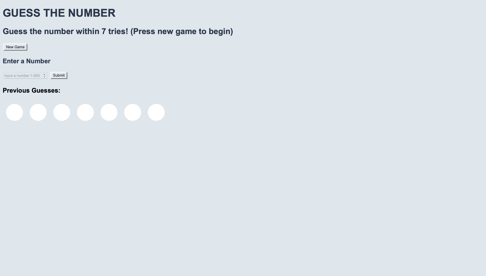
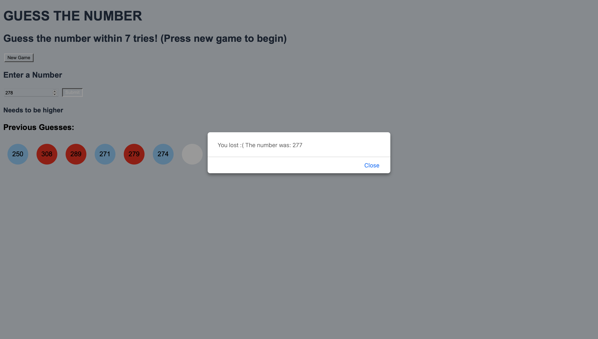

# Number Guessing Game

A fun and challenging number guessing game where you have to guess a randomly generated number between 1 and 500 within 7 attempts.

## How to Play

1. Clone this repository to your local machine or download the ZIP file.

2. Open the `number-guessing.html` file in your web browser.

3. You will be presented with a game screen that includes the following elements:
   - A prompt to enter your guess.
   - A "Submit" button to submit your guess.
   - A message area for feedback on your guesses.
   - A previous guesses are that will show you your previous guesses, as well as if they are too high or low

4. Enter your guess in the input field and click "Submit"

5. You will receive feedback on your guess:
   - If your guess is too high, you will be notified.
   - If your guess is too low, you will be notified.
   - If your guess is correct, you win the game!

6. Continue guessing until you either guess the correct number or run out of attempts (7 attempts in total).

7. If you guess the correct number, you will see a congratulatory message.

8. Regardless of the outcome, you can choose to play again by clicking the "New Game" button.

## Screenshots

## Technologies Used

- HTML
- CSS
- JavaScript (for game logic and random number generation)

## Features

- Randomly generated number between 1 and 500 for each game.
- User-friendly interface with clear instructions and feedback.
- Limit of 7 attempts to make the game challenging.
- Option to play again without reloading the page.

## Author

- Sydney Quach